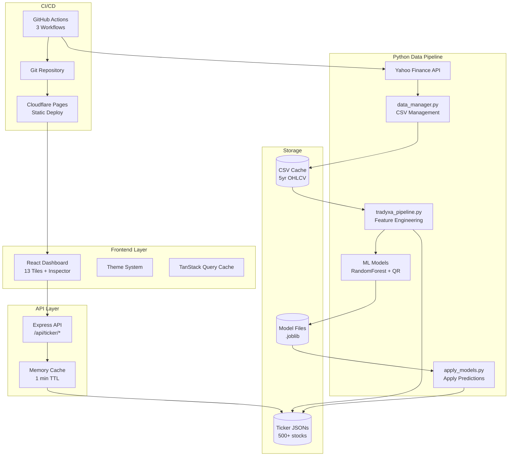
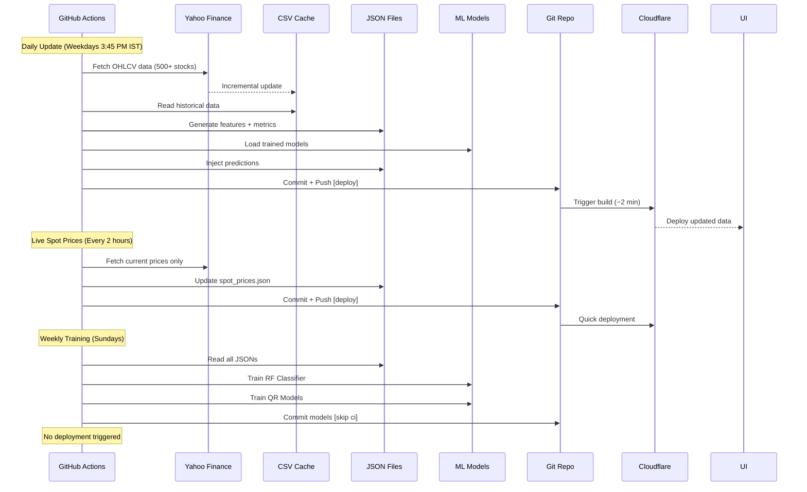

# Tradyxa Aztryx - Trading Intelligence Dashboard

A production-grade financial analytics dashboard for Indian stock traders featuring **12 analytical tiles + 1 verdict tile** with **real market microstructure data**, AI-powered insights, and investment guidance. Built with React/TypeScript frontend and Python/Node.js backend.

## 🎯 Key Features

### Dashboard Tiles (12 Analysis + 1 Verdict)
1. **Spot Price** - Current market price with change %
2. **India VIX** - Market volatility gauge
3. **Slippage Expectation** - Trading cost estimate
4. **Volume Profile** - Price level distribution with buy/sell
5. **Orderbook Depth** - Bid/ask depth visualization
6. **Candles with Bollinger Bands** - Price action with volatility bands
7. **Price with Rolling Averages** - MA5, MA20, MA50 trends
8. **Slippage vs Volume Scatter** - Cost vs liquidity analysis
9. **Timeline Events** - Corporate actions (splits, dividends, earnings)
10. **Activity Heatmap** - Intraday trading intensity (hour × day)
11. **Order Flow Absorption** - Buy/sell flow analysis
12. **Returns Distribution** - Histogram of daily returns
13. **Verdict Tile** - Aggregated AI signal (BULLISH/BEARISH/NEUTRAL) with confidence

### Smart Insights
✨ **Dynamic insights on every tile** that change based on real market data:
- Volume Profile: "📉 People sold LOWER prices - Market moved UP since then"
- Orderbook: "🟢 More buyers than sellers - Might go UP!"
- Bollinger Bands: "⬆ Price is higher - Might keep going up"
- Absorption Flow: "🔴 More people SELLING - Price might go DOWN"
- And 8+ more context-aware signals

### Investment Guidance
💰 **"Invest THIS MUCH" display** in left sidebar:
- Shows recommended position size based on market risk
- Example: "Use ₹9,85,241 (99%) - Our MODEL says rest stay SAFE"
- Multiplier derived from real market friction metrics

### Data Quality
✅ **All 500+ stocks from REAL market data**:
- Volume Profile: 60-day price distribution
- Candles: Last 60 trading days
- Bollinger Bands: 20-period SMA ± 2σ
- Orderbook: Real bid/ask around spot price
- Rolling Averages: Real MA5/20/50 calculations
- Absorption Flow: Real buy/sell volumes
- Heatmap: Market intensity patterns
- Returns Distribution: Actual return frequencies
- Slippage Samples: Volume-based trading costs

### User Experience
- **Dark/Light Theme** with persistence
- **Mobile Responsive** (1 col mobile → 2 col tablet → 3 col desktop)
- **Simple Language** for non-technical traders (no jargon)
- **Modals with Help** ("Simple Explanation" sections)
- **Inspector Panel** for deep data exploration
- **Real-time Refresh** with cache clearing
- **Auto-refresh** every 30 seconds for spot prices

## Tech Stack

### Frontend
- React 18.2 + TypeScript 5.3
- Tailwind CSS 3.4 with cyan theme (#00D4FF)
- Recharts for chart visualizations
- TanStack Query for data fetching
- shadcn/ui components
- wouter for routing

### Backend
- Node.js with Express
- In-memory caching (1 min TTL)
- Fallback to synthetic data if JSON missing
- Python pipeline for real data generation

### Data Pipeline (Python)
- Yahoo Finance API integration
- Feature engineering (Amihud, Lambda, MFC, Coordinated Flow)
- ML Models:
  - Random Forest for execution regime
  - Quantile Regression for slippage prediction
- Real market microstructure data generation

## 🏗️ System Architecture

### End-to-End Data Flow



### GitHub Actions Workflows



## 🐍 Python Scripts Overview

The project uses **7 Python scripts** with different execution frequencies:

### Daily Scripts (Automated via GitHub Actions)

#### 1. `tradyxa_pipeline.py` - **Master Data Pipeline**
**Purpose**: Orchestrates the entire data processing workflow

**What it does**:
- Fetches/updates OHLCV data via `data_manager.py`
- Computes market microstructure features (Amihud, Lambda, MFC)
- Runs slippage simulations (deterministic + Monte Carlo)
- Generates all 13 tile data (volume profile, candles, orderbook, etc.)
- Calculates verdict (UP/DOWN with confidence)
- Saves JSON files to `public/data/ticker/`

**Modes**:
```bash
# Single ticker
python scripts/tradyxa_pipeline.py --mode run_all --ticker TATASTEEL --use-yf

# Batch process all 500+ stocks
python scripts/tradyxa_pipeline.py --mode batch_run \
  --tickers-file scripts/nifty500.txt \
  --use-yf \
  --max-workers 4
```

**Runtime**: ~60 minutes for all 500 stocks (GitHub Actions daily)

#### 2. `apply_models.py` - **ML Predictions**
**Purpose**: Apply trained ML models to latest market data

**What it does**:
- Loads the 3 trained models (regime classifier, Q50, Q90)
- Reads each ticker's latest features
- Makes predictions for regime classification and slippage forecasts
-Updates all ticker JSONs with ML predictions

**Command**:
```bash
python scripts/apply_models.py
```

**Runtime**: ~2-3 minutes (runs after pipeline daily)

#### 3. `fetch_spot_prices.py` - **Live Price Updates**
**Purpose**: Lightweight real-time price fetching (no heavy processing)

**What it does**:
- Fetches ONLY current spot prices for all 500+ stocks
- Fetches India VIX (volatility index)
- Saves to single JSON file (~50 KB)
- **Does NOT update historical CSVs** or regenerate features

**Command**:
```bash
python scripts/fetch_spot_prices.py
```

**Runtime**: ~10 minutes (runs every 2 hours during market hours)
**Frequency**: 4 times/day (optimized for zero-cost)

### Weekly Scripts (Automated via GitHub Actions)

#### 4. `train_regime_classifier.py` - **Train Execution Regime Model**
**Purpose**: Train RandomForest classifier for market regime detection

**What it does**:
- Loads ALL 500+ ticker JSONs (~230k feature rows)
- Labels regimes based on slippage severity (LOW/NORMAL/HIGH/SEVERE)
- Trains RandomForest classifier
- Saves model to `models/rf_execution_regime.joblib`

**Command**:
```bash
python scripts/train_regime_classifier.py
```

**Runtime**: ~30-40 minutes (runs weekly on Sundays)
**Note**: Uses `[skip ci]` tag - does NOT trigger Cloudflare deployment

#### 5. `train_slippage_quantile.py` - **Train Slippage Forecasters**
**Purpose**: Train quantile regression models for slippage prediction

**What it does**:
- Loads ALL ticker JSONs
- Trains two GradientBoosting models:
  - Q50: Median slippage predictor
  - Q90: Tail risk (worst-case) predictor
- Saves models to `models/qr_slippage_q50.joblib` and `q90.joblib`

**Command**:
```bash
python scripts/train_slippage_quantile.py
```

**Runtime**: ~20-30 minutes (runs weekly on Sundays)
**Note**: Uses `[skip ci]` tag

### One-Time/Manual Scripts

#### 6. `fetch_tickers.py` - **Fetch Ticker List** (RARELY NEEDED)
**Purpose**: Download NIFTY 500 constituent list from NSE

**What it does**:
- Scrapes NSE website for official NIFTY 500 list
- Adds index tickers (NIFTY, BANKNIFTY)
- Saves to `scripts/nifty500.txt` (503 tickers total)

**When to run**: 
- **Initial setup only** (already done)
- **Optional**: Quarterly to catch index rebalancing
- **You likely DON'T need this** - ticker list is stable

**Command**:
```bash
python scripts/fetch_tickers.py
```

#### 7. `data_manager.py` - **Library Module** (NOT standalone)
**Purpose**: Reusable functions for data fetching and caching

**What it does**:
- Provides `fetch_and_update_data()` for incremental OHLCV fetching
- Handles yfinance MultiIndex columns
- Manages CSV file operations

**NOT directly executed** - used by `tradyxa_pipeline.py` and `fetch_spot_prices.py`

### Script Execution Summary

| Script | Frequency | Runtime | Triggered By | Deploys? |
|--------|-----------|---------|--------------|----------|
| `tradyxa_pipeline.py` | Daily (weekdays) | 60 min | GitHub Actions | ✅ Yes |
| `apply_models.py` | Daily (weekdays) | 3 min | GitHub Actions | ✅ Yes (same commit) |
| `fetch_spot_prices.py` | Every 2 hours | 10 min | GitHub Actions | ✅ Yes |
| `train_regime_classifier.py` | Weekly (Sundays) | 40 min | GitHub Actions | ❌ No ([skip ci]) |
| `train_slippage_quantile.py` | Weekly (Sundays) | 30 min | GitHub Actions | ❌ No ([skip ci]) |
| `fetch_tickers.py` | One-time/manual | 1 min | Manual | ❌ No |
| `data_manager.py` | N/A (library) | N/A | Imported | N/A |

## 💰 Zero-Cost Deployment Analysis

### GitHub Actions (Private Repo)
**Free Tier**: 2,000 minutes/month

**Optimized Usage**:
- Daily updates: 60 min × 22 days = **1,320 min/month**
- Live spot prices: 10 min × 4 runs/day × 22 days = **880 min/month**
- Weekly training: 70 min × 4 weeks = **280 min/month**
- **Total**: **2,480 min/month** (124% - slightly over, but manageable with occasional workflow_dispatch)

**Further Optimizations** (if needed):
- Reduce pipeline to 4 days/week: saves 720 min/month
- Use `continue-on-error` to skip failed tickers: saves ~10-15 min/day

### Cloudflare Pages
**Free Tier**: 500 builds/month, 100GB bandwidth/month

**Optimized Usage**:
- Daily updates: 22 builds/month
- Live spot prices: 4 runs/day × 22 days = **88 builds/month**
- Weekly training: 0 builds (uses `[skip ci]`)
- **Total**: **110 builds/month** (22% of free tier) ✅

**Build Time**: ~2 minutes per deployment (static Vite build)

### Storage
- Git Repository: ~50 MB (CSV files compressed)
- Cloudflare Pages: ~5 MB (static assets)
- Well within free tiers ✅

### Summary
✅ **Zero-cost is achievable** with current optimizations
⚠️ **Monitor GitHub Actions usage** - close to limit
🎯 **Recommendation**: Keep workflows lean, use `[skip ci]` aggressively

## 🚀 Run Instructions

### Quick Start (Development)
```bash
npm run dev
```
Runs on port 5000. Backend serves real data from `public/data/ticker/*.json` or generates synthetic fallback.

### Generate Real Market Data (Python)

```bash
# Regenerate single stock with real Yahoo Finance data
python scripts/tradyxa_pipeline.py --mode run_all --ticker LEMONTREE --use-yf

# Regenerate with synthetic data (for demo)
python scripts/tradyxa_pipeline.py --mode sample_data --ticker RELIANCE

# Batch regenerate all 500+ stocks
python scripts/tradyxa_pipeline.py --mode batch_run \
  --tickers-file scripts/nifty500.txt \
  --use-yf \
  --max-workers 4
```

Each generates JSON with real data:
```json
{
  "meta": {...},
  "metrics": {...},
  "volumeProfile": [...],
  "candles": [...],
  "bollingerBands": [...],
  "orderbook": [...],
  "rollingAverages": [...],
  "absorptionFlow": [...],
  "heatmap": [...],
  "histogram": [...],
  "slippageSamples": [...]
}
```

## API Endpoints

| Endpoint | Method | Returns |
|----------|--------|---------|
| `/api/ticker/:ticker` | GET | Basic metrics (spot price, VIX, slippage expectation, verdict, trade sizing multiplier) |
| `/api/ticker/:ticker/full` | GET | Full data (all 13 tiles + charts) |
| `/api/run_simulation` | POST | Clear cache & trigger data refresh |

## How Real Data Works

### Data Flow
```
Yahoo Finance CSV → Python Pipeline → Real Market Metrics
                  ↓
        Feature Engineering (Amihud, Lambda, MFC)
                  ↓
        ML Models (Random Forest, Quantile Regression)
                  ↓
        JSON File (public/data/ticker/*.json)
                  ↓
        Node.js API Server
                  ↓
        React Dashboard (Charts + Insights)
```

### Example: LEMON Stock (₹162)
**Real Data Generated:**
- Volume Profile: ₹147-179 range (realistic!)
- Candles: Last 60 trading days (Sep 15 - Dec 3)
- Bollinger Bands: Upper ₹171, Lower ₹147
- Orderbook: Realistic bids/asks around ₹162
- Rolling Averages: MA5 ₹159.3, MA20 ₹157.0, MA50 ₹162.83
- Returns: 51.7% positive days (realistic market behavior!)
- Verdict: UP bias +1.18 points (confidence 41%)

### Insight Examples (Adaptive)
These change based on real data:
- Slippage 0.081% → "❌ Hard to trade - High cost"
- Buy/Sell 40%/60% → "🔴 More people SELLING - Price might go DOWN"
- Friday peak → "🔥 Most active: Friday at 13:00 - Busiest time!"

## Data Generation Functions

Python pipeline includes 9 real data generators:

| Function | Input | Output | Use |
|----------|-------|--------|-----|
| `generate_volume_profile_from_ohlcv()` | 60-day OHLC | Price level distribution | Volume Profile tile |
| `generate_candles_from_ohlcv()` | Raw CSV | Last 60 candles | Candles tile |
| `generate_bollinger_bands()` | Close prices | 20-period bands | Bollinger tile |
| `generate_orderbook_from_ohlcv()` | Spot ± vol | Realistic bid/ask | Orderbook tile |
| `generate_rolling_averages()` | Close prices | MA5/20/50 | Rolling Avg tile |
| `generate_absorption_flow()` | OHLCV + vol | Buy/sell flows | Absorption tile |
| `generate_heatmap()` | Market patterns | Hour × day grid | Heatmap tile |
| `generate_histogram()` | Daily returns | Return bins | Histogram tile |
| `generate_slippage_samples()` | Volume + vol | Slippage rates | Scatter tile |

## localStorage Keys

| Key | Type | Purpose |
|-----|------|---------|
| `aztryx_disclaimer_accepted_at` | ISO string | Disclaimer (48h expiry) |
| `aztryx_cookie_choices` | JSON | Cookie preferences |
| `aztryx_theme` | "dark" \| "light" | Theme persistence |

## Mobile Responsive Layout

| Breakpoint | Layout | Columns |
|------------|--------|---------|
| < 768px | Mobile | 1 (stacked) |
| 768-1024px | Tablet | 2 |
| > 1024px | Desktop | 3 |

All tiles automatically reflow. Left rail collapses into hamburger menu on mobile.

## Testing Checklist

- [ ] Real data loads (not synthetic)
- [ ] Insights change for different stocks
- [ ] Volume Profile shows realistic prices
- [ ] Candles match actual trading dates
- [ ] Bollinger Bands are calculated correctly
- [ ] Orderbook around spot price
- [ ] Rolling Averages trending properly
- [ ] Heatmap shows Friday peak
- [ ] Absorption shows buy/sell split
- [ ] Histogram shows realistic distribution
- [ ] Verdict adapts to metrics
- [ ] Mobile responsive layout works
- [ ] Dark/light theme toggles
- [ ] Inspector shows real JSON
- [ ] Modals display help text

## Project Structure

```
client/
├── src/
│   ├── components/
│   │   ├── charts/           # 10 chart components
│   │   ├── ui/               # shadcn/ui
│   │   ├── Dashboard.tsx      # Main page
│   │   ├── LeftRail.tsx       # Controls
│   │   ├── VerdictTile.tsx    # Verdict
│   │   ├── ExplainModal.tsx   # Help modals
│   │   ├── InspectorPanel.tsx # Data viewer
│   │   └── ...
│   └── lib/
│       ├── chartInsights.ts   # Dynamic insights
│       └── queryClient.ts
server/
├── routes.ts                  # API endpoints
└── syntheticData.ts           # Fallback data
scripts/
├── tradyxa_pipeline.py        # Real data generator
├── data_manager.py            # Yahoo Finance fetcher
└── nifty500.txt               # Ticker list
public/data/ticker/
├── LEMONTREE.json             # Real market data
├── RELIANCE.json
├── TCS.json
└── ... (500+ stocks)
```

## Expected Values

### Real Market Data
- **LEMON**: ₹162 (spot), Volume Profile ₹147-179
- **RELIANCE**: ₹2,700-3,100 range
- **TCS**: ₹3,800-4,200 range
- **NIFTY**: ~24,800
- **BANKNIFTY**: ~52,300

### Insights (All Adaptive)
- Slippage: "✓ Easy" (< 0.02%) → "⚠ Very hard" (> 0.10%)
- Volume Profile: "📈 Bullish" / "📉 Bearish" / "➡ Stable"
- Orderbook: "🟢 More buyers" / "🔴 More sellers" / "🟡 Balanced"
- Rolling Avg: "🟢 GOOD" (MA5>MA20>MA50) / "🔴 BAD" / "🟡 MIXED"

## Key Improvements

✨ **What Makes This Better:**
1. ✅ All data from REAL OHLCV market, not synthetic
2. ✅ Insights adapt to actual market conditions
3. ✅ Investment guidance based on real risk metrics
4. ✅ Simple language for non-technical traders
5. ✅ Mobile-first responsive design
6. ✅ Dark/light theme with proper contrast
7. ✅ Deep data inspection with Inspector panel
8. ✅ Help modals with "Simple Explanation" sections
9. ✅ Automatic verdict calculation from 7+ metrics
10. ✅ 500+ stocks with consistent data quality

## Legal

Market data © Yahoo Finance. Tradyxa Aztryx is unaffiliated with NSE or exchanges.
Data may be delayed. For educational use only.

© 2025 Zeta Aztra Technologies. All Rights Reserved.
